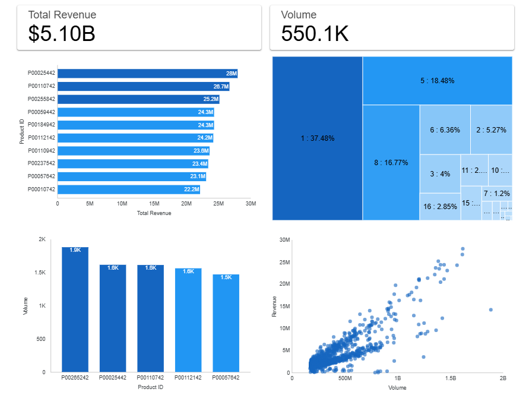

# Sales Analysis of Top-Selling Products and Categories on Walmart’s E-Commerce Platform

## Overview
This project analyzes Walmart’s e-commerce sales to identify top-performing products and categories, measure their revenue and volume contributions, and highlight potential pricing or promotional opportunities. By examining product-level and category-level performance, the analysis reveals revenue distribution patterns and the strong correlation between sales volume and revenue. The insights inform strategic actions to optimize product visibility, pricing, and campaign targeting for sustained growth.

## Dataset
- **Source:** [Kaggle - Walmart E-commerce](https://www.kaggle.com/datasets/devarajv88/walmart-sales-dataset)
- **Key Features:** Product_ID, User_ID, Product_Category, Purchase.

## Tools & Libraries
Python, Pandas, Matplotlib, Seaborn, Tableau / Power BI

## Key Insights
- **Top Products by Revenue:**  
  - P00025442 → USD 26.7M  
  - P00110742 → USD 26.7M  
  - P00255842 → USD 25.1M  
  Revenue gap is small, indicating **demand is spread evenly** across products.
- **Top Products by Volume:**  
  - P00265242 → 1,880 sales (not in top 10 revenue list).  
  - P00025442 & P00110742 both ~1,615 sales with only a 3-unit difference.
- **Top Categories by Revenue:**  
  - Category 1 → 37.48% of total revenue  
  - Category 5 → USD 941.8M  
  - Category 8 → USD 854.3M  
  Combined → ~72% of total revenue.
- **Strong positive correlation** between sales volume and revenue.

## Recommendations
- Focus on **Category 1, 5, and 8** through targeted campaigns and promotions.
- Reassess **pricing strategies** for high-volume but low-revenue products (e.g., P00265242).
- Compare pricing between **similar-volume products** to identify revenue gaps.
- Increase visibility for **products with rising sales volume** to convert into revenue.
- Monitor **outliers** for potential new best-sellers or shifts in demand.

## Dashboard
[**View Interactive Dashboard**](https://lookerstudio.google.com/reporting/4d2c03af-531b-4c06-b35e-49e91be1cbac)

## Project Files
- [Notebook](walmart-e-commerce-sales-analysis.ipynb)
- [Presentation](Sales%20Analysis%20of%20Top-Selling%20Products%20and%20Categories%20on%20Walmart%E2%80%99s%20E-Commerce%20Platform.pptx)

## Author
Ahsan Mubarak
